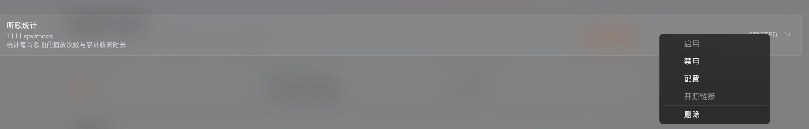
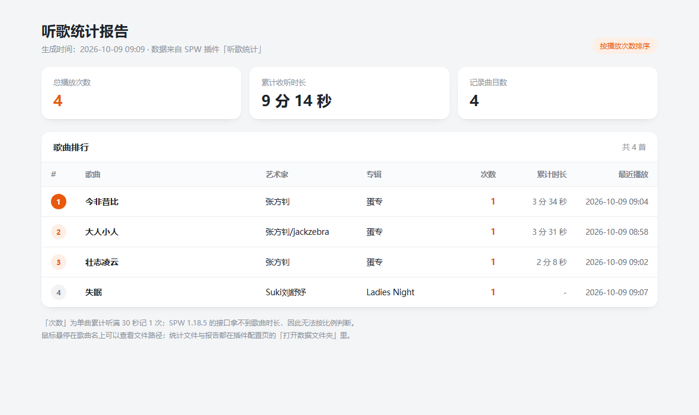

# 听歌统计 · Salt Player for Windows Mod

[](https://github.com/zhaozian81/salt-player-listen-stats/actions/workflows/build.yml)
[](https://github.com/zhaozian81/salt-player-listen-stats/releases)
[](LICENSE)
[](#关于-ai-生成)

> [!WARNING]
> **本项目的代码、测试与文档（含本 README）由 AI 生成。**
> 具体分工：AI 编程助手负责写代码 / 测试 / 文档 / CI 配置，人类负责提出需求、在真实环境测试、
> 验收与发布。功能已在真实 SPW 1.18.5 上验证（安装、计数、报表、更新），但 AI 生成的代码仍可能
> 存在未覆盖的问题，**使用前请自行评估风险**；发现 Bug 欢迎提 Issue。
> 详见 [「关于 AI 生成」](#关于-ai-生成)。

自动记录**每首歌听了多少次、累计听了多久**，并在插件配置页一键生成 HTML 报表。

| 模组管理 | 统计报表 |
| --- | --- |
|  |  |

## 特性

- **按遍计数**：同一首歌累计听满 30 秒算 1 次；暂停、拖动进度条不会灌水
- **循环也认**：单曲循环、手动拖回开头都会开始新的一遍，听满 30 秒再计一次
- **一键报表**：配置页生成 HTML 报表（排行榜 / 累计时长 / 最近播放），自动调用浏览器打开
- **数据透明**：纯文本 `Properties`，可直接打开看、可备份、可手工修改
- **兼容两个世代**：同一份产物在 SPW 1.18.5（`.zip`）与 1.19.0+（`.spmod`）都能加载，见 [docs/host-compat.md](docs/host-compat.md)

## 安装

1. 到 [Releases](https://github.com/zhaozian81/salt-player-listen-stats/releases) 下载 `plugin-com.spwmods.listenstats-<版本>.zip`
2. 复制到插件目录（在资源管理器地址栏粘贴这一行回车）：

   ```
   %APPDATA%\Salt Player for Windows\workshop\plugins
   ```

3. 启用插件，二选一：
   - 打开 SPW → 设置 → 创意工坊（模组管理）→ 听歌统计 → **启用**
   - 完全退出 SPW，在 `workshop\plugins\enabled.txt` 里加一行 `com.spwmods.listenstats`
4. **完全退出** SPW（托盘图标也要退出）再打开

> ⚠️ 两点必看：
> - 插件目录里**只放一个副本**（不要 `.zip` 和 `.spmod` 同时存在，否则会被识别成两个同 ID 插件）
> - **更新版本时先删掉旧的展开目录** `workshop\plugins\plugin-com.spwmods.listenstats-*`，
>   宿主的 PF4J 只在展开目录不存在时才会重新解压

## 使用

配置页位置：**设置 → 创意工坊（模组管理）→ 听歌统计 → 配置**

| 按钮 | 作用 |
| --- | --- |
| 查看统计摘要 | 吐司显示总播放次数、累计收听时长、最常听的 5 首 |
| 生成统计报告 | 生成 HTML 报表并尝试用浏览器打开 |
| 打开数据文件夹 | 打开统计数据与报表所在目录 |
| 清空统计 | **连点两次**确认后清空全部记录 |

数据目录：

```
%APPDATA%\Salt Player for Windows\workshop\data\com.spwmods.listenstats\
├─ listen-stats.db.properties   统计本体（Properties 文本）
├─ listen-stats.log             每次插件启动记一行（版本 / 宿主版本 / 数据目录）
└─ listen-stats-report.html     点"生成统计报告"后出现
```

## 计数规则

| 情况 | 规则 |
| --- | --- |
| 正常听一首歌 | 累计听满 **30 秒**算 1 次，同一遍只算 1 次 |
| 为什么不是"听一半" | SPW 1.18.5 的 `MediaItem` 没有时长字段，插件拿不到歌曲长度，只能按固定秒数判断 |
| 暂停 | 不计时（宿主仍每秒回调，但播放位置不前进） |
| 拖动进度条 | 跳过的那段不计入时长，也不会白送一次 |
| 单曲循环 / 拖回开头 | 算新的一遍，再听满 30 秒会再计 1 次 |
| 切歌 / 播放结束 | 结算这一遍的累计时长并写盘 |
| 单次回调最多认可 5 秒 | 防止宿主一次性跳进带来虚假时长 |

不统计：插件未启用期间听的歌、安装之前的播放、以及**启用插件时正在播放的那首歌**
（旧版 API 不允许插件主动查询"当前播放的是哪首"，只能等下一次换曲）。

## 兼容性

| SPW 版本 | 可用的分发包 | 状态 |
| --- | --- | --- |
| 1.18.5 | `plugin-*.zip` | 实测通过（20 项集成检查，见下文工具） |
| 1.19.0+ | `plugin-*.spmod` 或 `plugin-*.zip` | 上游约定 `.spmod`；本仓库两种后缀都产出 |

插件本体只使用两个版本**共有**的 API 成员，因此用新版 API 编译出来的产物在旧宿主上也能加载。
这一点不是推测：仓库里的兼容性验证工具会用旧宿主的真实 API + 真实 PF4J 把打包产物完整加载一遍。

## 从源码构建

要求：JDK 21+。

```bash
./gradlew test pluginZip
```

产物：

```
build/libs/plugin-com.spwmods.listenstats-<版本>.spmod   # 上游约定后缀
build/libs/plugin-com.spwmods.listenstats-<版本>.zip     # 兼容 1.18.5 的加载器
```

依赖说明：

- 上游 API `com.github.Moriafly:spw-workshop-api:0.1.0-dev21` **JitPack 上的 jar 是空的**
  （只有 308 字节、没有任何类），所以本仓库自带了一份真 jar，见 [local-repo/README.md](local-repo/README.md)。
  上游修好后删掉 `local-repo/` 与本仓库 `settings.gradle.kts` 里的 `local-repo` 声明即可，坐标不用改。
- 打包 Gradle 插件 `com.xuncorp.spw.workshop` 仍按上游文档从 JitPack 拉取。
- **离线构建**：先把上游产物发布到 mavenLocal，再构建本仓库：

  ```bash
  cd spw-workshop-api && ./gradlew :api:publishToMavenLocal :gradle-plugin:publishToMavenLocal
  cd salt-player-listen-stats && ./gradlew --offline test pluginZip
  ```

## 兼容性验证工具（可选，不需要启动播放器）

```powershell
cd tools\compat-check
# 1) 从本机已安装的 SPW 里抽出旧版 API 类，做成编译桩
powershell -ExecutionPolicy Bypass -File .\extract-host-api.ps1
# 2) 用真实 PF4J + 旧宿主同款加载流程验证分发包（20 项检查）
powershell -ExecutionPolicy Bypass -File .\run-verify.ps1 -PluginZip ..\..\build\libs\plugin-com.spwmods.listenstats-1.1.4.zip
```

还可以用真实统计数据生成报表预览：

```powershell
powershell -ExecutionPolicy Bypass -File .\preview-report.ps1 -PluginZip ..\..\build\libs\plugin-com.spwmods.listenstats-1.1.4.zip `
    -DbFile "$env:APPDATA\Salt Player for Windows\workshop\data\com.spwmods.listenstats\listen-stats.db.properties"
```

## 项目结构

```
src/main/kotlin/com/spwmods/listenstats/
├─ ListenStatsPlugin.kt      插件主类：启动日志、启用提示、停用时结算落盘
├─ ListenStatsExtension.kt   播放扩展点：换曲识别、有效播放累计、计数判定
├─ StatsStore.kt             统计读写（原子写入）、清空、启动日志
└─ StatsReport.kt            配置页按钮 + HTML 报表模板
src/main/resources/preference_config.json   声明式配置界面
src/test/kotlin/...          15 个单元测试 + 对齐新版 API 的假宿主
tools/compat-check/          旧宿主兼容性验证 / 报表预览
docs/host-compat.md          宿主加载器逆向结论：为什么必须 .zip、enabled.txt 是白名单
```

## 常见问题

**插件列表里看不到「听歌统计」**
分发包后缀必须是 `.zip` 或 `.jar`——SPW 1.18.5 的加载器直接忽略 `.spmod`；另外确认目录里没有第二个副本。

**看得到，但一直没有数据**
插件没被启用。旧宿主的 `enabled.txt` 是**白名单**：不在里面的插件会被加载但保持 `DISABLED`，扩展点也不会激活。

**更新后行为没变化**
残留了旧的展开目录。删掉 `workshop\plugins\plugin-com.spwmods.listenstats-*` 后重启。

**怎么确认它真的在跑**
看 `workshop\data\com.spwmods.listenstats\listen-stats.log` 里有没有当次启动那一行。

## 发布流程（维护者）

1. 改 `build.gradle.kts` 里的 `version`，同步更新 `CHANGELOG.md` 与 README 里的示例文件名
2. `./gradlew test pluginZip` 本地自测
3. 打 tag 并推送：

   ```bash
   git tag v1.1.4 && git push origin main --tags
   ```

4. GitHub Actions 的 `release` 工作流会自动构建并把 `.zip` / `.spmod` 挂到 Release 上

> 记得给仓库加上 `salt-player-plugins` topic（上游 API 文档的发现机制），这样插件更容易被找到。

## 关于 AI 生成

本项目是一个**人机协作**的成果：AI 负责产出，人类负责把关和发布。为了让使用者心里有数，这里把话说清楚。

| 项目 | 说明 |
| --- | --- |
| 生成方式 | 代码、测试、文档（含本 README）、GitHub Actions 配置均由 AI 编程助手（DeepSeek 模型驱动）编写，人类以对话方式提出需求、反馈问题、决定取舍 |
| 人类负责的部分 | 需求定义与验收、在真实播放器上测试（安装 / 听歌 / 报表 / 更新）、发布决策、后续维护与答疑 |
| 验证手段 | ① 15 个单元测试；② `tools/compat-check/` 用**真实 PF4J + 旧宿主 API** 对打包产物做 20 项加载验证；③ 在真实 SPW 1.18.5 上安装运行，用插件自己写的 `listen-stats.log` 确认加载 |
| 发布产物验证 | 每次发布的 `.zip` 都是 CI 从源码构建的；本仓库发布前会把**线上那个文件下载回来**再跑一遍 20 项验证 |
| 已知局限 | 旧版 API 拿不到歌曲时长，因此按固定 30 秒判定"听过"；启用插件时正在播放的那首歌不计入 |
| 风险提示 | AI 生成的代码可能存在边界情况未覆盖、注释与实现不符等问题。请在使用前自行评估；欢迎提 Issue 或 PR（人类会审阅） |

> 如果你对"AI 生成"有顾虑，可以不使用本项目；如果你愿意帮忙 review，我们非常欢迎 —— 仓库里的
> `docs/host-compat.md` 与 `tools/compat-check/` 已经把关键结论、复现步骤都写明了，方便独立核对。

## License

[Apache-2.0](LICENSE) © 2026 zhaozian81

---

## English

**Listen Stats** is a plugin for *Salt Player for Windows* (SPW) that counts how many times each track
was actually listened to (a play is counted after 30 seconds of effective playback) and renders an
HTML report from the in-app plugin page.

> ⚠️ **AI-generated project.** The code, tests, documentation and CI configuration were written by an
> AI coding assistant; a human defined the requirements, tested it on a real SPW 1.18.5 installation,
> and published the releases. Use at your own risk, and feel free to open an issue.
> See [关于 AI 生成](#关于-ai-生成) for details (Chinese).

Download the `.zip` from [Releases](https://github.com/zhaozian81/salt-player-listen-stats/releases),
drop it into `%APPDATA%\Salt Player for Windows\workshop\plugins\`, enable it under
**Settings → Workshop / Mod management**, and restart the player. On SPW 1.18.5 the loader only scans
`.zip`/`.jar` (not `.spmod`) and treats `enabled.txt` as a whitelist — see
[docs/host-compat.md](docs/host-compat.md) for the details.

Build with `./gradlew test pluginZip` (JDK 21+). Licensed under Apache-2.0.
